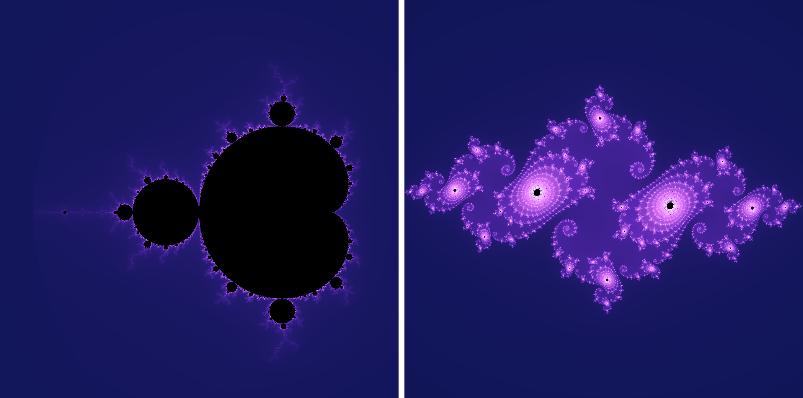
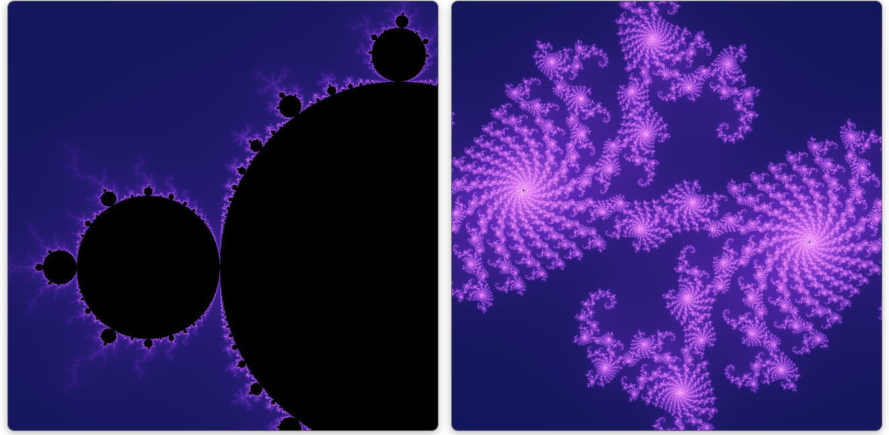
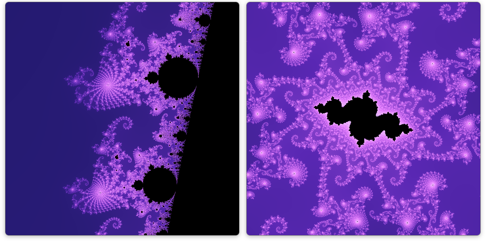

# Mandelbrot–Julia Explorer

An interactive visualization tool for exploring the relationship between the Mandelbrot set and Julia sets.

The project combines a FastAPI backend for high-performance numerical computation with a TypeScript frontend for interactive visualization using HTML Canvas.

---

# マンデルブロ集合・ジュリア集合ビューア

マンデルブロ集合とジュリア集合の対応関係を可視化するためのインタラクティブなビューワです。

バックエンドでは FastAPI と Numba を用いて集合を高速に計算し，フロントエンドでは TypeScript と HTML Canvas を用いて描画を行います。

本プロジェクトは，将来的に**複素力学系の可視化・教育ツール**として発展させることを目標としています。

---

## Screenshots

### Initial View



The initial view shows the Mandelbrot set together with the corresponding Julia set.

```text
View center
Re(z) = -0.75
Im(z) = 0.1

Scale
1×
```

---

### Favorite Region



A moderately magnified region showing filament structures.

```text
View center
Re(z) = -0.74
Im(z) = 0.18

Scale
2×
```



A highly magnified region exhibiting intricate self-similar structures.

```text
View center
Re(z) = -0.743643887
Im(z) = 0.131825904

Scale
128×
```

---

## Features

### Implemented

- Real-time correspondence between the Mandelbrot set and Julia sets
- Interactive Mandelbrot set viewer
- Corresponding Julia set visualization
- FastAPI backend
- TypeScript frontend
- HTML Canvas rendering
- Numba-accelerated computation
- Mouse drag for panning
- Mouse wheel zoom
- Smooth coloring
- 2×2 supersampling

### Planned

- Click on the Mandelbrot set to change the Julia parameter
- Independent navigation of the Julia set
- Multiple color maps
- Favorite locations
- High-resolution image export
- Animation along parameter paths
- Orbit visualization

---

## Project Structure

```text
Mandelbrot-Julia-Explorer/
├── backend/
│   ├── main.py
│   ├── mandelbrot.py
│   └── julia.py
│
├── frontend/
│   ├── src/
│   │   ├── main.ts
│   │   ├── render.ts
│   │   ├── redraw.ts
│   │   ├── drag.ts
│   │   ├── zoom.ts
│   │   ├── draw.ts
│   │   ├── updateJuliaPanel.ts
│   │   └── colormap.ts
│   │
│   ├── index.html
│   └── style.css
│
└── README.md
```

---

## Run Backend

```bash
uvicorn backend.main:app --reload
```

Backend

```
http://localhost:8000
```

---

## Run Frontend

```bash
cd frontend

npm install
npm run dev
```

Frontend

```
http://localhost:5173
```

---

## Technologies

### Backend

- Python
- FastAPI
- Numba

### Frontend

- TypeScript
- HTML Canvas
- Vite

---

## Future Vision

The long-term goal of this project is to become a research and educational visualization tool for complex dynamics.

Planned extensions include interactive parameter exploration, orbit visualization, external rays, bifurcation structures, and other topics related to the dynamics of complex quadratic polynomials.

---

## Mathematical Background

The Mandelbrot set consists of complex parameters c for which the orbit

$z_{n+1}=z_n^2 + c$

starting from z₀=0 remains bounded.

For each parameter c, the corresponding Julia set is generated by the same iteration with varying initial values.

---

## License

This project is licensed under the MIT License.
