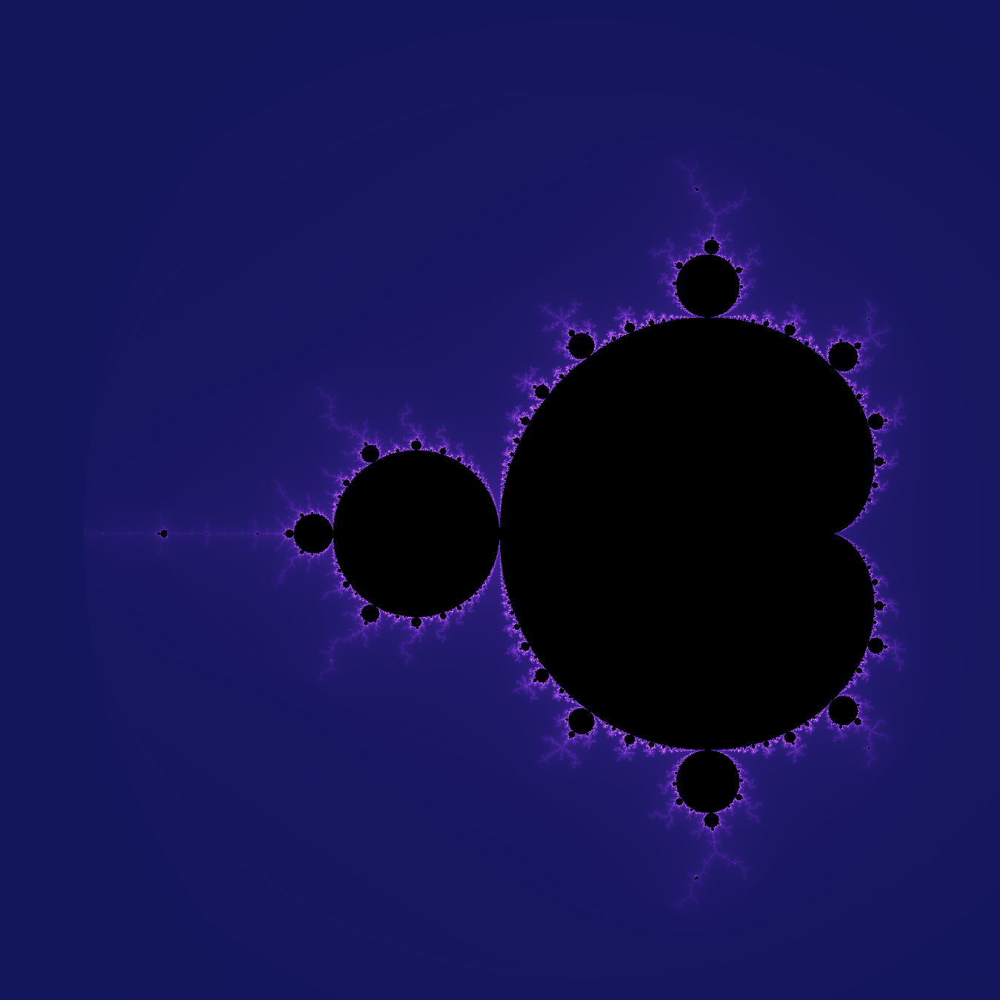
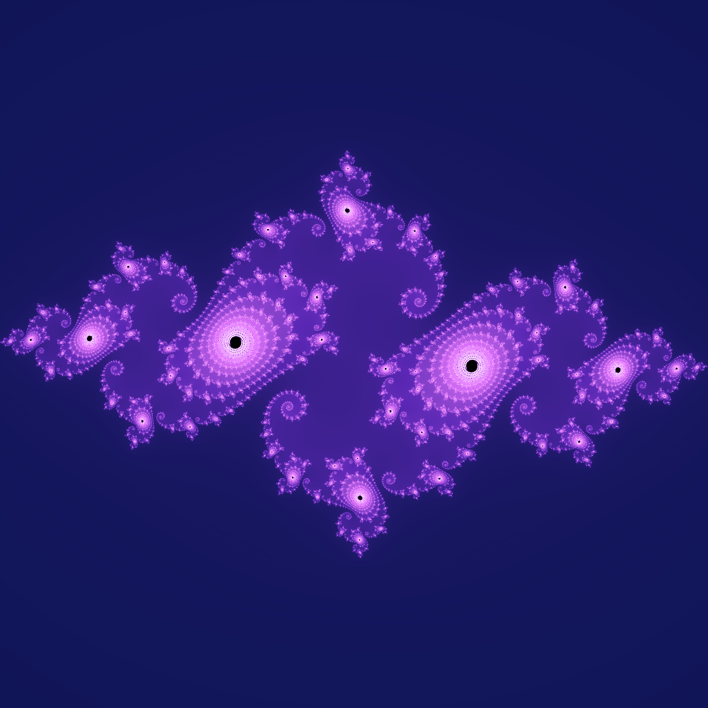
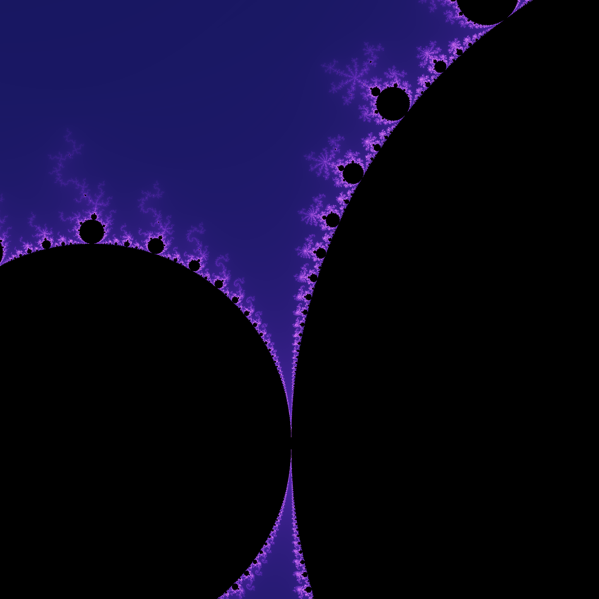
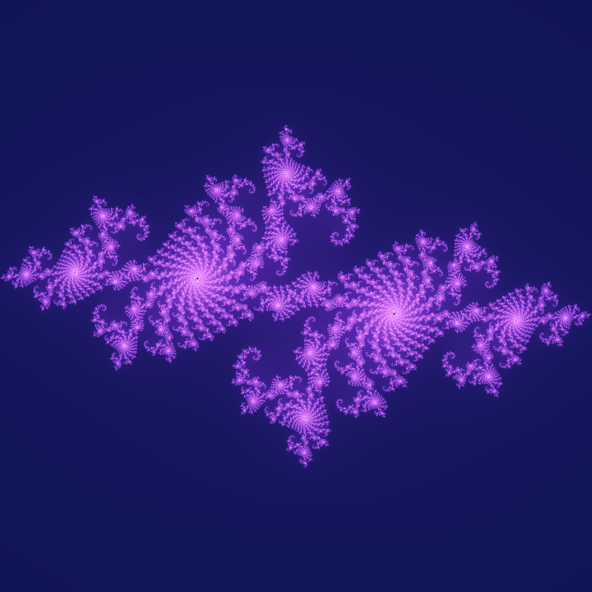
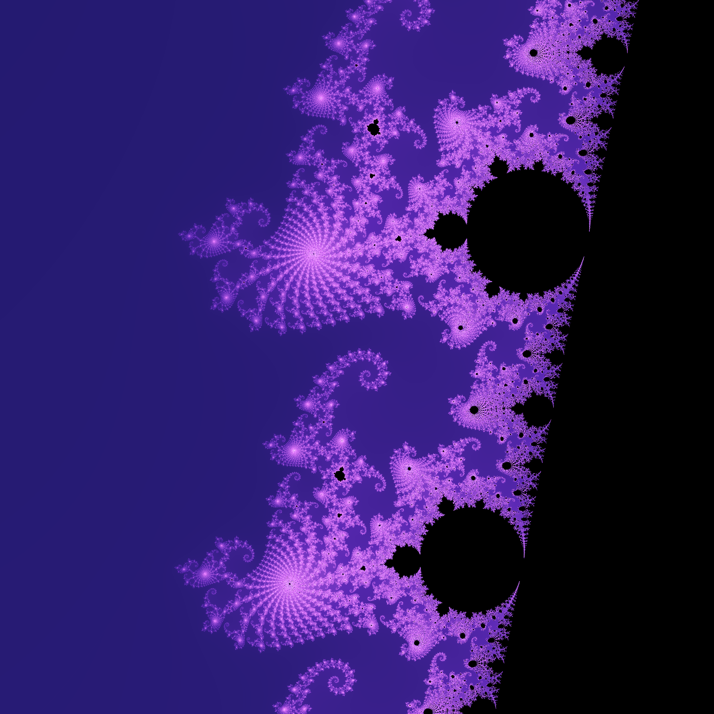
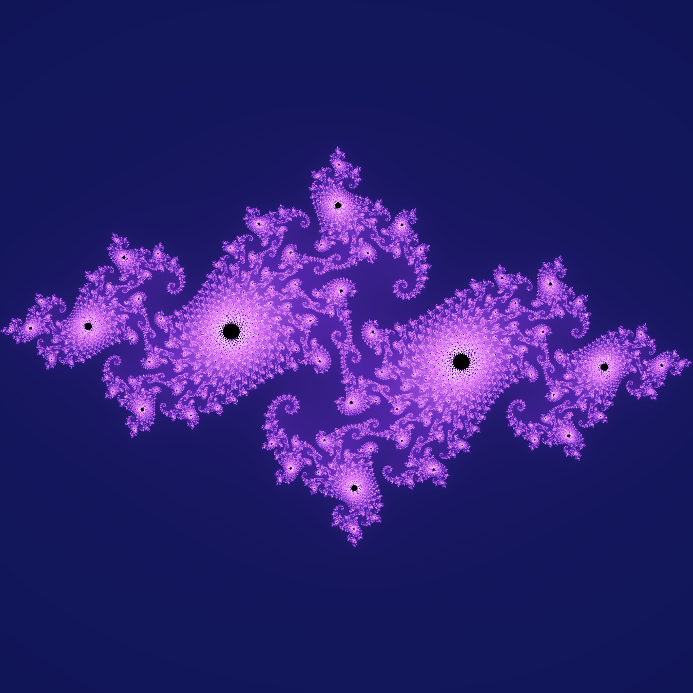
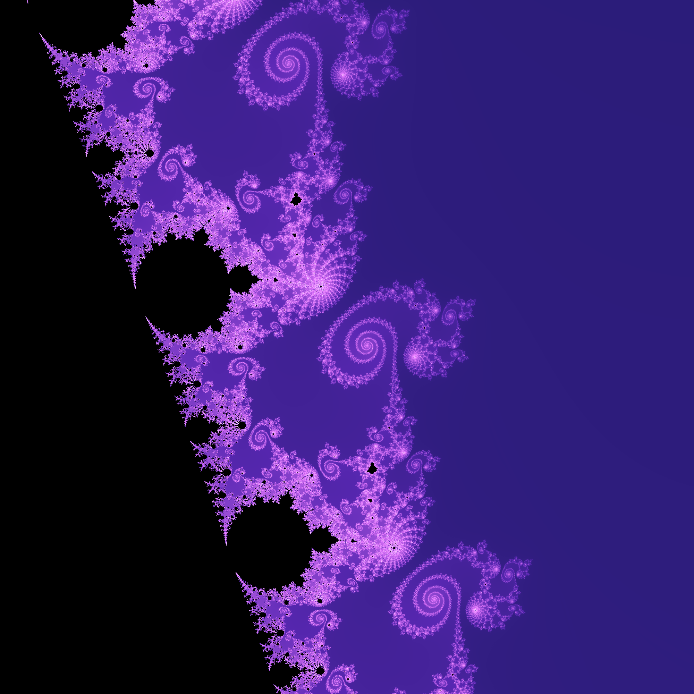
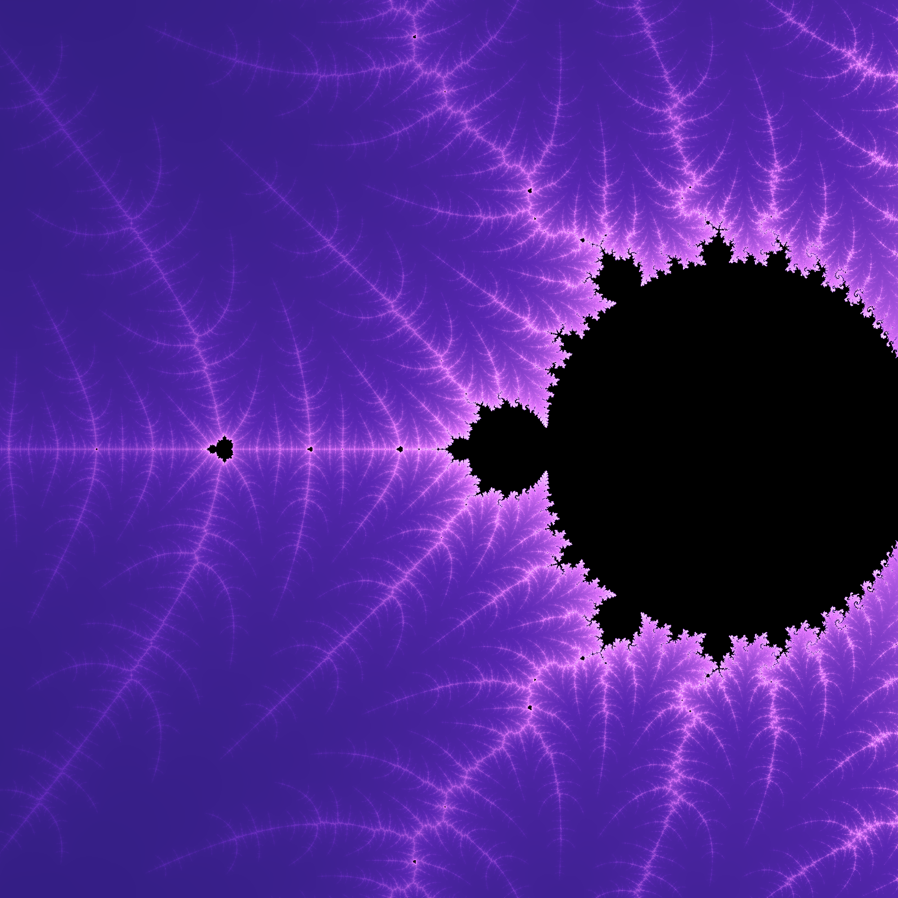
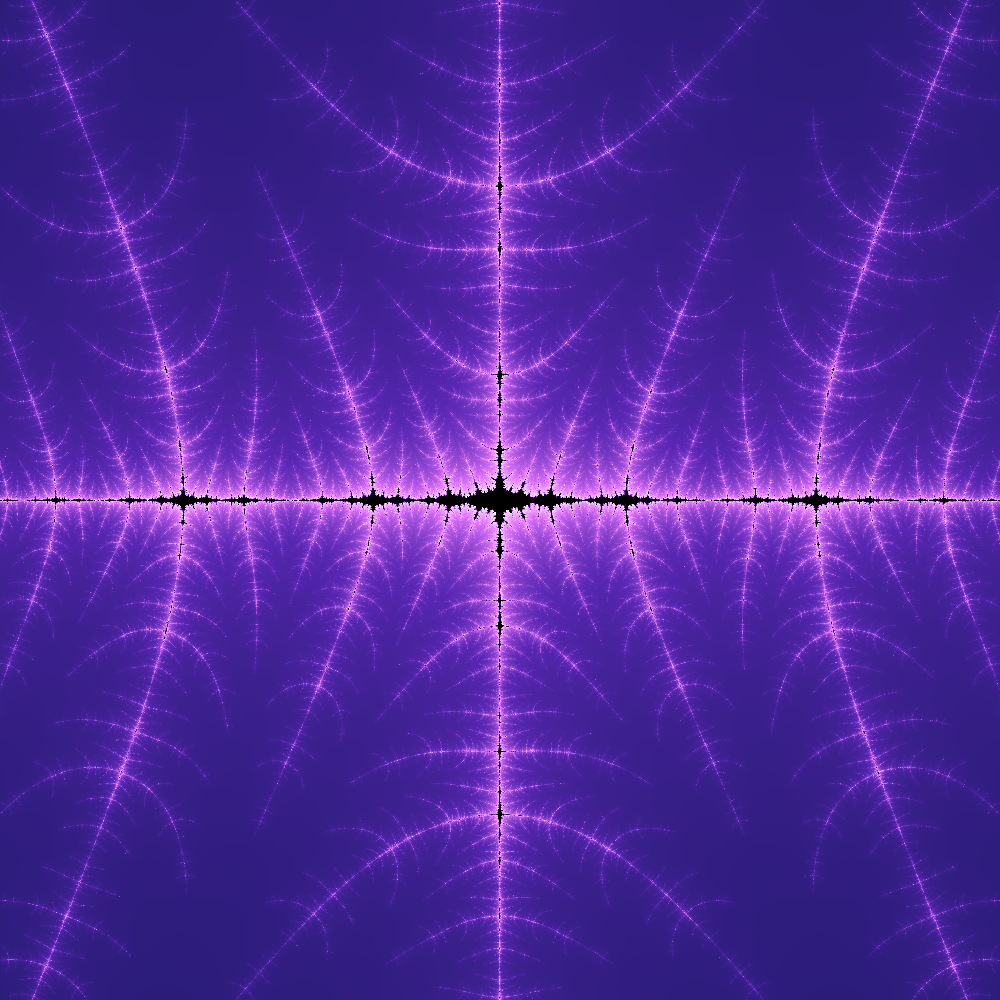
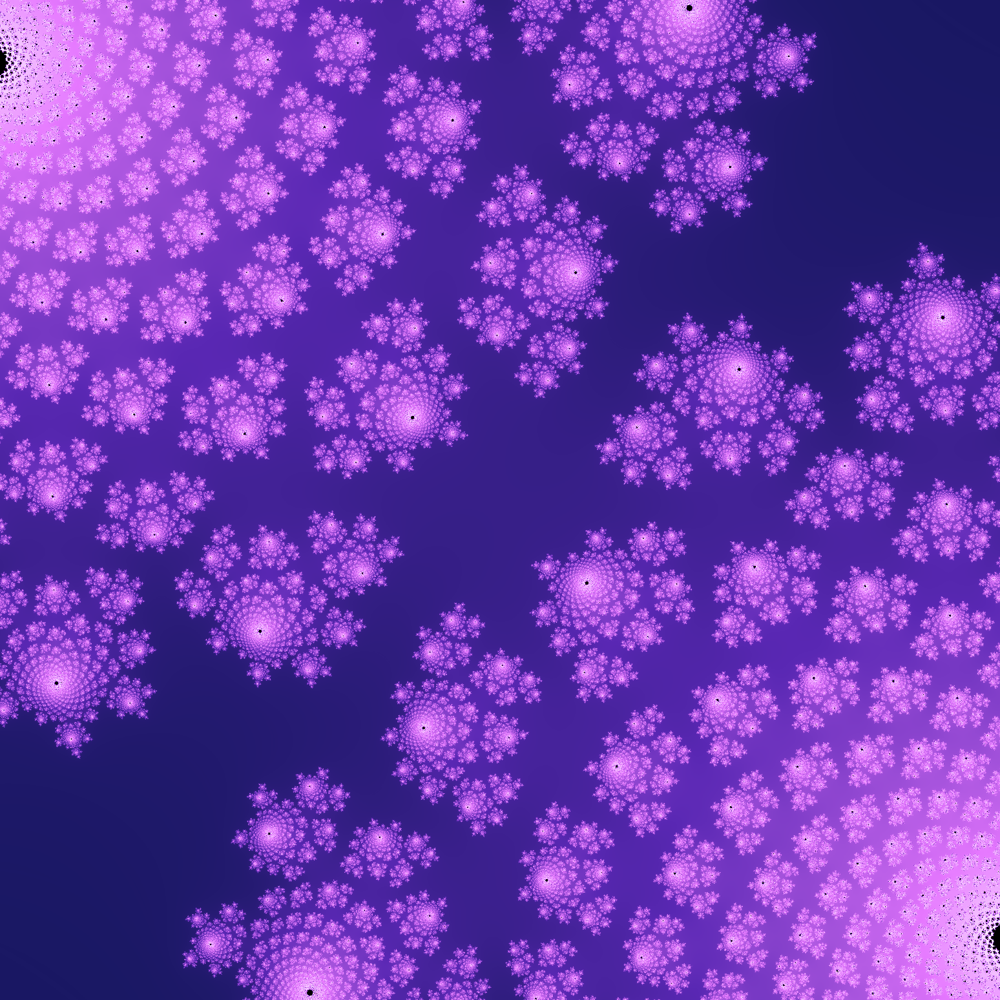

# Mandelbrot–Julia Explorer

An interactive visualization tool for exploring the relationship between the Mandelbrot set and Julia sets.

The project combines a FastAPI backend for high-performance numerical computation with a TypeScript frontend for interactive visualization using HTML Canvas.

---

# マンデルブロ集合・ジュリア集合可視化ツール

マンデルブロ集合とジュリア集合の対応関係を可視化するためのインタラクティブな可視化ツールです。

バックエンドでは FastAPI と Numba を用いて集合を高速に計算し，フロントエンドでは TypeScript と HTML Canvas を用いて描画を行います。

本プロジェクトは，将来的に**複素力学系の可視化・教育ツール**として発展させることを目標としています。

---

## Screenshots

### Initial View

<div align="center">




</div>

The initial view displays the Mandelbrot parameter plane together with the corresponding Julia set.

The interface shows:

- Mandelbrot view center and zoom level
- Julia parameter \(c\)
- Julia view center and zoom level
- Rendering statistics (render time, resolution, iterations)

### Mandelbrot Set

```text
View center
Re(z) = -0.75
Im(z) = 0.10

Scale
1×
```

### Julia Set

```text
Parameter
c = -0.75 + 0.10i

View center
Re(z) = 0.00
Im(z) = 0.00

Scale
1×
```

---

### Favorite Region 1

<div align="center">




</div>

主カージオイド近傍を拡大した例です。対応するジュリア集合では，対称性を保ちながら渦巻くフィラメント構造が形成されます。

A zoomed view near the main cardioid of the Mandelbrot set. The corresponding Julia set reveals a pair of symmetric spiral structures connected by delicate filamentary patterns, demonstrating the close relationship between the parameter plane and the dynamical plane.

### Mandelbrot Set

```text
View center
Re(z) = -0.74
Im(z) = 0.18

Scale
4×
```

### Julia Set

```text
Parameter
c = -0.74 + 0.18i

View center
Re(z) = 0.00
Im(z) = 0.00

Scale
1×
```

### Favorite Region 2

<div align="center">




</div>

マンデルブロ集合の境界付近を128倍まで拡大した領域です。境界には自己相似なフィラメント構造が密集しており，対応するジュリア集合では渦状の枝分かれと島状の構造が画面全体に現れます。このような複雑な幾何学模様は，マンデルブロ集合とジュリア集合の対応関係を特徴づける代表的な例です。

A 128× magnification near the boundary of the Mandelbrot set. The parameter plane exhibits densely packed self-similar filaments, while the corresponding Julia set develops intricate spiral branches and disconnected island-like structures throughout the dynamical plane. This region illustrates the rich geometric correspondence between the Mandelbrot set and its associated Julia set.

### Mandelbrot Set

```text
View center
Re(z) = -0.743643887
Im(z) = 0.131825904

Scale
128×
```

### Julia Set

```text
Parameter
c = -0.743643887 + 0.131825904i

View center
Re(z) = 0.00
Im(z) = 0.00

Scale
1×
```

### Favorite Region 3

<div align="center">




</div>

マンデルブロ集合の境界に現れる渦巻き状の自己相似構造を拡大した領域です。

対応するジュリア集合では，対称性の高い大きな渦が形成され，マンデルブロ集合上のわずかなパラメータの変化が，力学系全体の形状に大きな影響を与えることが分かります。

A magnified view of a region where spiral-shaped self-similar structures emerge along the boundary of the Mandelbrot set.

The corresponding Julia set exhibits large symmetric spiral patterns, illustrating how a small change in the parameter on the Mandelbrot set produces a dramatically different global dynamical structure.

### Mandelbrot Set

```text
View center
Re(z) = -0.761574
Im(z) = 0.0847596

Scale
256×
```

### Julia Set

```text
Parameter
c = -0.761574 + 0.0847596i

View center
Re(z) = 0.00
Im(z) = 0.00

Scale
1×
```

### Favorite Region 4

<div align="center">




</div>

マンデルブロ集合の実軸付近を高倍率で拡大した領域です。

対応するジュリア集合では，これまでの渦巻き状の構造とは異なり，十字状の対称性を持つ樹状のフラクタルが現れます。同じ二次写像であっても，パラメータの違いによって力学系の幾何学的特徴が大きく変化することが分かります。

A highly magnified view near the real axis of the Mandelbrot set.

Unlike the previous examples, the corresponding Julia set develops a dendritic fractal with striking cross-shaped symmetry instead of spiral structures. This illustrates how subtle changes in the parameter can produce dramatically different geometries in the associated dynamical system.

### Mandelbrot Set

```text
View center
Re(z) = -1.401155
Im(z) = 0.0

Scale
1024×
```

### Julia Set

```text
Parameter
c = -1.401155 + 0.0i

View center
Re(z) = 0.00
Im(z) = 0.00

Scale
32×
```

### Favorite Region 5

<div align="center">




</div>

マンデルブロ集合の境界付近に現れる多数のミニ・マンデルブロと渦状構造を拡大した領域です。

対応するジュリア集合では，自己相似なロゼット状の構造が平面全体に広がり，花が咲き並ぶような幾何学模様が現れます。同じ二次写像から，パラメータの選び方によってこれほど多様な形状が生まれることを示す一例です。

A magnified region near the boundary of the Mandelbrot set containing numerous mini-Mandelbrot copies and spiral structures.

The corresponding Julia set is filled with self-similar rosette-like patterns that resemble a field of blooming flowers. This example highlights the remarkable diversity of geometries that can arise from the same quadratic map by varying only the complex parameter.

### Mandelbrot Set

```text
View center
Re(z) = -0.421
Im(z) = 0.58

Scale
128×
```

### Julia Set

```text
Parameter
c = -0.421 + 0.58i

View center
Re(z) = 0.00
Im(z) = 0.00

Scale
4×
```

---

## Features

### Implemented

- Real-time correspondence between the Mandelbrot set and Julia sets
- Independent navigation of the Julia set
- Mouse drag for panning
- Mouse wheel zoom
- Keyboard shortcut (`S`) for exporting images
- Individual export of Mandelbrot and Julia views
- Combined side-by-side image export
- Automatic filenames including parameter values and zoom levels
- FastAPI backend
- TypeScript frontend
- HTML Canvas rendering
- Numba-accelerated computation
- Smooth coloring
- 2×2 supersampling

### Planned

- Click on the Mandelbrot set to change the Julia parameter
- Multiple color maps
- Favorite locations
- High-resolution image export
- Animation along parameter paths
- Orbit visualization

---

## Image Export

Press **`S`** to save the current visualization.

The application automatically exports three PNG images:

- `mandelbrot_*.png`
- `julia_*.png`
- `mandelbrot_julia_*.png`

Each filename automatically includes

- the selected complex parameter `(Re(c), Im(c))`
- the Mandelbrot zoom level
- the Julia zoom level

For example,

```text
mandelbrot_-0.743644_0.131826_m128_j32.png
julia_-0.743644_0.131826_m128_j32.png
mandelbrot_julia_-0.743644_0.131826_m128_j32.png
```

This makes it easy to organize and reproduce interesting parameter locations.

---

## Project Structure

```text
Mandelbrot-Julia-Explorer/
├── backend/
│   ├── main.py
│   ├── mandelbrot.py
│   └── julia.py
│
├── frontend/
│   ├── src/
│   │   ├── main.ts
│   │   ├── render.ts
│   │   ├── redraw.ts
│   │   ├── drag.ts
│   │   ├── zoom.ts
│   │   ├── draw.ts
│   │   ├── dragJulia.ts
│   │   ├── zoomJulia.ts
│   │   ├── updateJuliaPanel.ts
│   │   └── colormap.ts
│   │
│   ├── index.html
│   └── style.css
│
└── README.md
```

---

## Run Backend

```bash
uvicorn backend.main:app --reload
```

Backend

```
http://localhost:8000
```

---

## Run Frontend

```bash
cd frontend

npm install
npm run dev
```

Frontend

```
http://localhost:5173
```

---

## Technologies

### Backend

- Python
- FastAPI
- NumPy
- Numba

### Frontend

- TypeScript
- HTML Canvas
- Vite

---

## Design

The application is intentionally separated into two independent layers.

- FastAPI is responsible only for numerical computation.
- TypeScript is responsible only for rendering and interaction.

This separation allows future extensions such as GPU computation, image export, and additional fractal families without changing the frontend architecture.

---

## Future Vision

The long-term goal of this project is to become a research and educational visualization tool for complex dynamics.

Planned extensions include interactive parameter exploration, orbit visualization, external rays, bifurcation structures, and other topics related to the dynamics of complex quadratic polynomials.

---

## Mathematical Background

This application visualizes two different complex planes.

### Mandelbrot Set (Parameter Plane)

The Mandelbrot set consists of complex parameters c for which the orbit

```math
z_{n+1}=z_n^2+c,\quad z_0=0
```

remains bounded.

The left panel displays a region of this parameter plane.

### Julia Set (Dynamical Plane)

For a fixed parameter c, the Julia set is obtained by iterating

```math
z_{n+1}=z_n^2+c
```

for different initial values z.

The right panel displays this dynamical plane using the parameter currently selected in the Mandelbrot view.

---

## License

Licensed under the MIT License.
